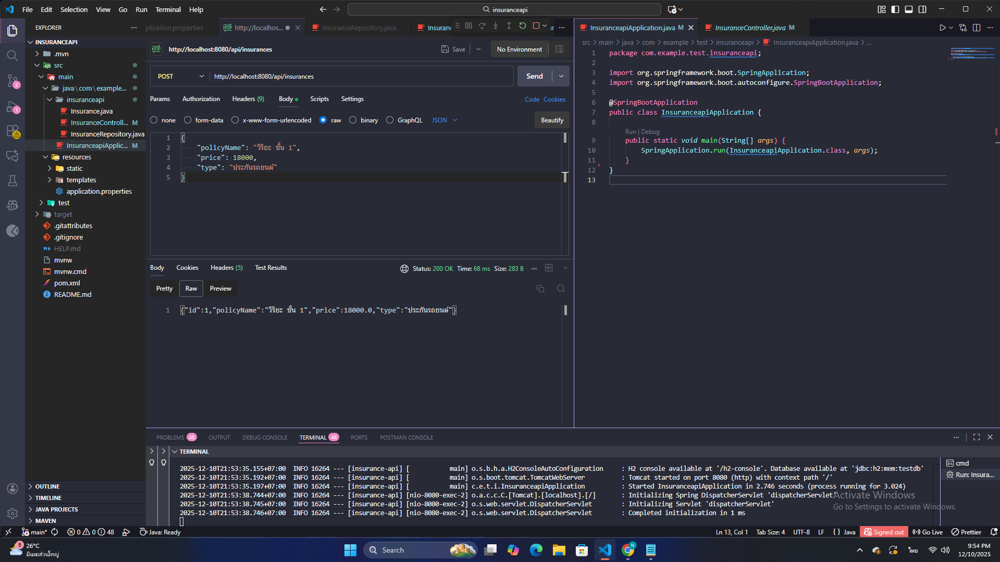
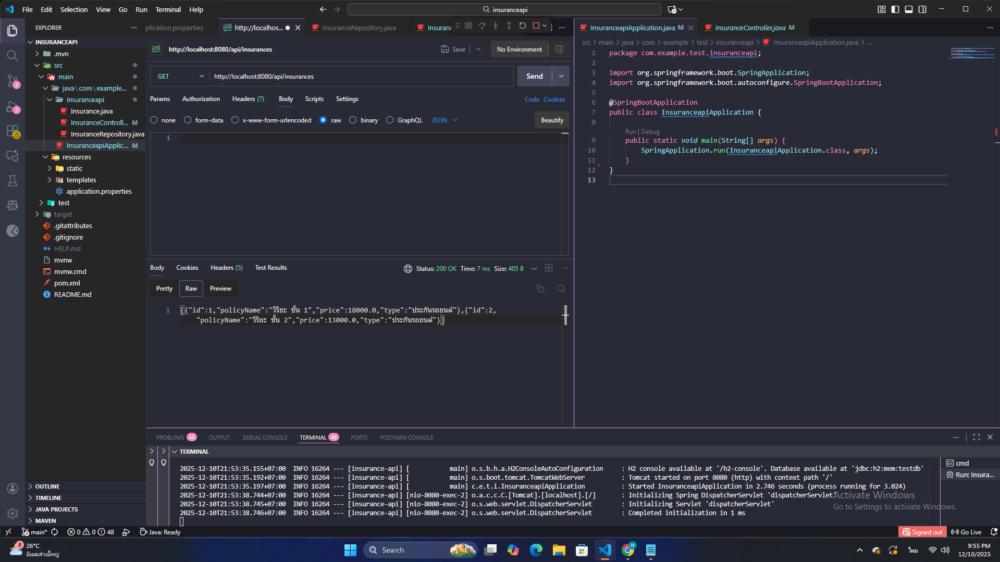
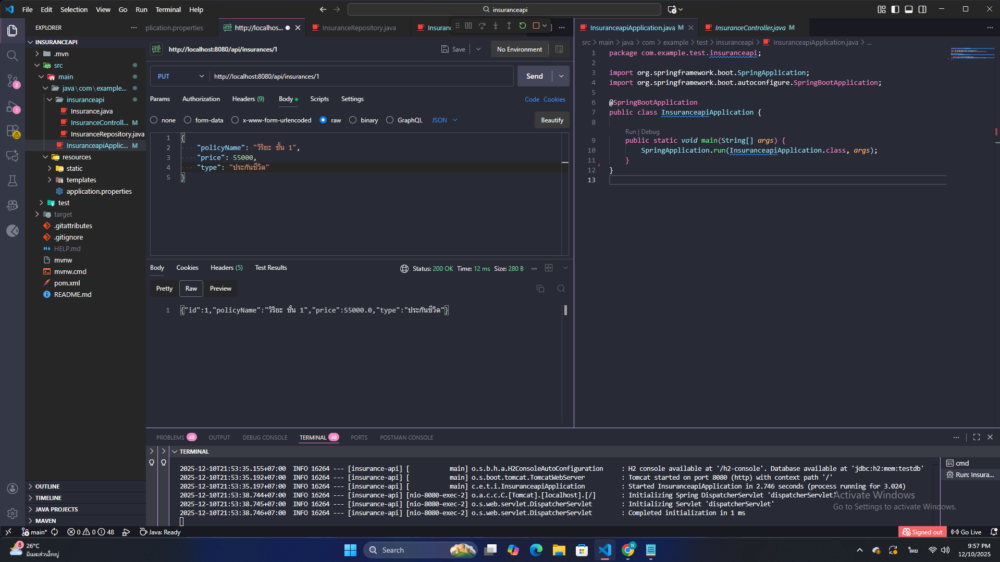
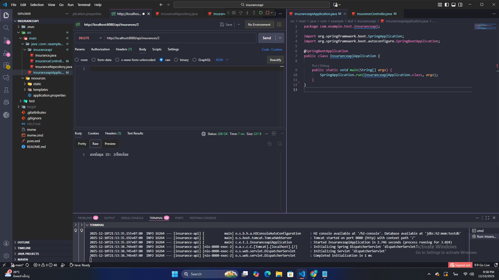

#  Insurance API (Spring Boot Demo)

Micro-service สำหรับจัดการข้อมูลประกันภัย (Insurance Management System)
โปรเจกต์นี้จัดทำขึ้นเพื่อ **Proof of Concept (PoC)** ในการเรียนรู้โครงสร้าง **Spring Boot** และ **JPA** ภายในระยะเวลา 1 วัน เพื่อเตรียมความพร้อมสำหรับฝึกงานในตำแหน่ง Backend Developer

##  Objectives (สิ่งที่ได้เรียนรู้)
- เปลี่ยนถ่ายทักษะจาก **Node.js (Express)** มาสู่ **Java (Spring Boot)**
- เรียนรู้การทำ **Dependency Injection** ด้วย `@Autowired`
- การจัดการ Database ผ่าน **Spring Data JPA** (Hibernate)
- การสร้าง **RESTful API** มาตรฐาน (CRUD Operations)

##  Tech Stack
- **Language:** Java 21
- **Framework:** Spring Boot 3.x
- **Database:** H2 Database (In-Memory for Demo)
- **Tools:** Maven, Lombok, Postman

##  API Endpoints
ระบบรองรับการทำงานแบบ Full CRUD ดังนี้:

| Method | Endpoint | Description |
| :--- | :--- | :--- |
| `GET` | `/api/insurances` | ดึงข้อมูลประกันทั้งหมด |
| `GET` | `/api/insurances/{id}` | ดึงข้อมูลตาม ID |
| `POST` | `/api/insurances` | สร้างประกันใหม่ |
| `PUT` | `/api/insurances/{id}` | แก้ไขข้อมูลประกัน |
| `DELETE` | `/api/insurances/{id}` | ลบข้อมูลประกัน |

### Example Payload (JSON) for POST/PUT
```json
{
    "policyName": "Viriyah First Class",
    "price": 25000.00,
    "type": "Car Insurance"
}

## 📸 API Testing Results (Postman Evidence)
หลักฐานการทดสอบการทำงานของ API ครบทุกฟังก์ชัน (CRUD):

| Operation | Screenshot |
| :--- | :--- |
| **1. Create Data (POST)** |  |
| **2. Read All (GET)** |  |
| **3. Update (PUT)** |  |
| **4. Delete (DELETE)** |  |